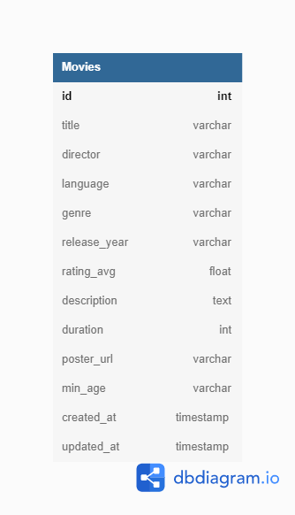

<div align="center">
    <h1> </h1>
    <h2>🎬 Cinema API 🎬</h2>
    <hr />
    <p>
    <a href="https://nodejs.org/en/"></a>
    <a href="https://opensource.org/licenses/MIT"></a>
    </p>
</div>

## 📜 Descrição

<p>
    A Cinema API é o projeto de finalização do Módulo 4 da Resilia. Trata-se do back-end de uma aplicação para a manipulação da entidade <b>Movie</b>.
</p>
<p>
    A API possui a arquitetura REST e pode ser utilizada para realizar as operações CRUD da entidade Movie.
</p>

<br>

---

<br>

## ✨ Funcionalidades

A API pode realizar as seguintes operações:

- [x] Encontrar todos os filmes
- [x] Encontrar um filme pelo id
- [x] Encontrar um filme pelo title
- [x] Adicionar um filme
- [x] Atualizar um filme pelo id
- [x] Deletar um filme pelo id

<br>

---

<br>

## 🛠️ Tecnologias e ferramentas

Foram utilizadas as seguintes tecnologias e ferramentas no projeto:

- [Javascript](https://developer.mozilla.org/pt-BR/docs/Web/JavaScript)
- [Node.js](https://nodejs.org/en/)
- [Express](https://expressjs.com/pt-br/)
- [Sequelize](https://sequelize.org/)
- [MySQL](https://www.mysql.com/)
- [SQLite](https://www.sqlite.org/index.html)
- [Jest](https://jestjs.io/pt-BR/)

<br>

---

<br>

## 📶 Modelagem ER

<br>

<div align="center">



</div>

<br>

---

<br>

# 🌟 Rodando a aplicação

## Requerimentos

- [Git](https://git-scm.com/) instalado
- [Node](https://node.js.org/) instalado
- [Npm](https://www.npmjs.com/) instalado
- [MySQL](https://dev.mysql.com/downloads/) instalado (se for rodar o banco localmente)

<br>

### Siga as etapas para a aplicação funcionar corretamente:

<br>

#### 1️⃣ No terminal bash (Git), clone este repositório

```
git clone https://github.com/v-giorgio/cinema-api.git
```

<br>

#### 2️⃣ Acesse a pasta do projeto pelo terminal

```
cd cinema-api
```

<br>

#### 3️⃣ Abra o projeto no editor de texto (VSCode)

```
code .
```

<br>

#### 4️⃣ Abra o terminal e execute o comando para instalar as dependências do projeto

```
npm install
```

<br>

#### 5️⃣ Acesse o arquivo `.env.example` e copie o seu conteúdo. Crie um novo arquivo chamado `.env` e cole o conteúdo nele.

```
PORT =

DB_DIALECT=mysql
DB_USERNAME=root
DB_PASSWORD=
DB_HOST=localhost
DB_PORT=3306
DB_DATABASE=cinema
```

#### <b>Nos campos vazios, preencha com os dados para rodar o banco de dados na sua máquina.</b>

#### <b>Atenção</b>:

- O campo PORT altera a porta utilizada para rodar a API. Se não for definida, a API rodará normalmente na porta 3007.
- O campo DB_USERNAME, por padrão, é `root`. Você pode alterá-lo se quiser utilizar uma conexão de banco diferente.
- O campo DB_PORT, por padrão, é `3306`, mas você também pode alterá-lo se quiser criar a conexão com o banco em outra porta.

<br>

#### 6️⃣ Agora você pode criar o banco de dados na sua máquina. Utilize o comando

```
npm run database
```

<br>

#### 7️⃣ Execute o comando para criar a tabela Movies no banco

```
npm run migrate
```

<br>

#### 8️⃣ (Opcional) Execute o comando para popular o banco com registros iniciais

```
npm run seed
```

<br>

#### 9️⃣ Execute a aplicação

```
npm start
```

<br>

---

<br>

## Deploy no Heroku (instável no momento - será corrigido em breve)

Se preferir não rodar o banco em sua máquina, você pode interagir com a API hospedada no [Heroku](https://dashboard.heroku.com/). Basta utilizar a URI:
<br>

```
https://cinema-api-resilia.herokuapp.com/
```

<br>

Na pasta `collections` deste repositório, você encontra um [arquivo](https://github.com/v-giorgio/cinema-api/tree/main/collections) com requisições suportadas pela API para testar no [Postman](https://www.postman.com/) ou no [Insomnia](https://insomnia.rest/download).

<br>

---

<br>

## 🔃 Rotas da API

#### 🪧 `/movies`

Rota para <b>encontrar</b> todos os filmes.<br>
Método: `GET`<br>

Resposta:

```
[
	{
		"id": 1,
		"title": "Moonlight",
		"director": "Barry Jenkins",
		"language": "Inglês",
		"genre": "drama",
		"release_year": "2016-10-21",
		"rating_avg": 98,
		"description": "Em Moonlight: Sob a Luz do Luar, acompanhamos três momentos da vida de Chiron, um jovem negro morador de uma comunidade pobre de Miami. Do bullying na infância, passando pela crise de identidade da adolescência e a tentação do universo do crime e das drogas, este é um poético estudo de personagem.",
		"duration": 111,
		"poster_url": "https://uauposters.com.br/media/catalog/product/cache/1/image/333x500/9df78eab33525d08d6e5fb8d27136e95/1/1/115020180226-uau-posters-filmes-moonlight.jpg",
		"min_age": 17,
		"createdAt": "2022-04-16T19:48:44.000Z",
		"updatedAt": "2022-04-16T19:48:44.000Z"
	},
	{
		"id": 2,
		"title": "Us",
		"director": "Jordan Peele",
		"language": "Inglês",
		"genre": "terror",
		"release_year": "2019-03-22",
		"rating_avg": 93,
		"description": "As férias tranquilas de uma família se transformam em um pesadelo quando sósias sinistros batem à sua porta tarde da noite.",
		"duration": 116,
		"poster_url": "https://m.media-amazon.com/images/M/MV5BZTliNWJhM2YtNDc1MC00YTk1LWE2MGYtZmE4M2Y5ODdlNzQzXkEyXkFqcGdeQXVyMzY0MTE3NzU@._V1_.jpg",
		"min_age": 17,
		"createdAt": "2022-04-16T19:48:44.000Z",
		"updatedAt": "2022-04-16T19:48:44.000Z"
	},
	{
		"id": 3,
		"title": "Bacurau",
		"director": "Kleber Mendonça",
		"language": "Português",
		"genre": "mistério",
		"release_year": "2020-05-12",
		"rating_avg": 93,
		"description": "Num futuro próximo, Bacurau, uma pequena cidade brasileira no oeste de Pernambuco, lamenta a perda de sua matriarca, Carmelita (Lia de Itamaracá), que viveu até os 94 anos. Dias depois, seus habitantes aos poucos percebem algo estranho acontecer na região: enquanto drones passeiam pelos céus, estrangeiros chegam pela primeira vez na cidade com planos de exterminar toda a população ali residente, carros são atingidos por tiros e cadáveres começam a aparecer. Os habitantes chegam à conclusão de que estão sendo atacados. Resta identificar o inimigo e criar coletivamente um meio de defesa.",
		"duration": 132,
		"poster_url": "https://br.web.img3.acsta.net/pictures/19/07/23/23/24/0636548.jpg",
		"min_age": 16,
		"createdAt": "2022-04-16T19:48:44.000Z",
		"updatedAt": "2022-04-16T19:48:44.000Z"
	},
	{
		"id": 4,
		"title": "Your name Engraved Herein",
		"director": "Kuang-Hui Liu",
		"language": "Chinês",
		"genre": "romance",
		"release_year": "2020-09-30",
		"rating_avg": 88,
		"description": "Em 1987, após o fim da lei marcial em Taiwan, Jia-han e Birdy se apaixonam e são alvo de homofobia, pressão familiar e estigma social.",
		"duration": 118,
		"poster_url": "https://upload.wikimedia.org/wikipedia/pt/2/2c/Your_Name_Engraved_Herein.png",
		"min_age": 13,
		"createdAt": "2022-04-16T19:48:44.000Z",
		"updatedAt": "2022-04-16T19:48:44.000Z"
	},
	{
		"id": 5,
		"title": "Spirited Away",
		"director": "Hayao Miyazaki",
		"language": "Japonês",
		"genre": "fantasia",
		"release_year": "2001-07-20",
		"rating_avg": 97,
		"description": "Chihiro é uma garota de 10 anos que acredita que todo o universo deve atender aos seus caprichos. Ao descobrir que vai se mudar, ela fica furiosa. Na viagem, Chihiro percebe que seu pai se perdeu no caminho para a nova cidade, indo parar defronte um túnel aparentemente sem fim, guardado por uma estranha estátua. Curiosos, os pais de Chihiro decidem entrar no túnel e Chihiro vai com eles. Chegam numa cidade sem nenhum habitante e os pais de Chihiro decidem comer a comida de uma das casas, enquanto a menina passeia. Ela encontra com Haku, garoto que lhe diz para ir embora o mais rápido possível e ao reencontrar seus pais, Chihiro fica surpresa ao ver que eles se transformaram em gigantescos porcos. É o início da jornada de Chihiro por um mundo fantasma, povoado por seres fantásticos, no qual humanos não são bem-vindos.",
		"duration": 125,
		"poster_url": "https://uauposters.com.br/media/catalog/product/cache/1/image/9df78eab33525d08d6e5fb8d27136e95/3/3/330720211103-uau-posters-a-viagem-de-chihiro-estudio-ghibli-filmes.jpg",
		"min_age": 13,
		"createdAt": "2022-04-16T19:48:44.000Z",
		"updatedAt": "2022-04-16T19:48:44.000Z"
	}
]
```

#### 🪧 `/movies/:id`

Rota para <b>encontrar</b> um filme pelo id.<br>
Método: `GET`<br>
Informe o <b>id</b> do filme que deseja encontrar na rota<br>

Resposta:<br>

`/movies/44`

```
{
	"id": 1,
	"title": "Moonlight",
	"director": "Barry Jenkins",
	"language": "Inglês",
	"genre": "drama",
	"release_year": "2016-10-21",
	"rating_avg": 98,
	"description": "Em Moonlight: Sob a Luz do Luar, acompanhamos três momentos da vida de Chiron, um jovem negro morador de uma comunidade pobre de Miami. Do bullying na infância, passando pela crise de identidade da adolescência e a tentação do universo do crime e das drogas, este é um poético estudo de personagem.",
	"duration": 111,
	"poster_url": "https://uauposters.com.br/media/catalog/product/cache/1/image/333x500/9df78eab33525d08d6e5fb8d27136e95/1/1/115020180226-uau-posters-filmes-moonlight.jpg",
	"min_age": 17,
	"createdAt": "2022-04-16T19:48:44.000Z",
	"updatedAt": "2022-04-16T19:48:44.000Z"
}
```

#### 🪧 `/movies/title`

Rota para <b>encontrar</b> um filme pelo título.<br>
Método: `POST`<br>
Template para enviar os dados:

```
{
	"title": "Your name Engraved Herein"
}
```

<br>
Resposta:

```
{
	"id": 4,
	"title": "Your name Engraved Herein",
	"director": "Kuang-Hui Liu",
	"language": "Chinês",
	"genre": "romance",
	"release_year": "2020-09-30",
	"rating_avg": 88,
	"description": "Em 1987, após o fim da lei marcial em Taiwan, Jia-han e Birdy se apaixonam e são alvo de homofobia, pressão familiar e estigma social.",
	"duration": 118,
	"poster_url": "https://upload.wikimedia.org/wikipedia/pt/2/2c/Your_Name_Engraved_Herein.png",
	"min_age": 13,
	"createdAt": "2022-04-16T19:48:44.000Z",
	"updatedAt": "2022-04-16T19:48:44.000Z"
}
```

#### 🪧 `/movies`

Rota para <b>adicionar</b> um filme.<br>
Método: `POST`<br>
Template para enviar os dados:

```
{
	"title": "Filme Teste",
	"director": "Diretor Teste",
	"language": "Linguagem Teste",
	"genre": "Gênero Teste",
	"release_year": "2012-12-12",
	"rating_avg": 12,
	"description": "Descrição Teste",
	"duration": 12,
	"poster_url": "teste",
	"min_age": 12
}
```

<br>
Resposta:

```
{
	"id": 6,
	"title": "Filme Teste",
	"director": "Diretor Teste",
	"language": "Linguagem Teste",
	"genre": "Gênero Teste",
	"release_year": "2012-12-12",
	"rating_avg": 12,
	"description": "Descrição Teste",
	"duration": 12,
	"poster_url": "teste",
	"min_age": 12,
	"updatedAt": "2022-04-16T20:29:57.327Z",
	"createdAt": "2022-04-16T20:29:57.327Z"
}
```

#### 🪧 `/movies/:id`

Rota para <b>atualizar</b> um filme pelo id.<br>
Método: `PUT`<br>
Template para enviar os dados:

```
{
	"genre": "romance"
}
```

<br>
Resposta:<br>

`/movies/1`

```
{
	"id": 1,
	"title": "Moonlight",
	"director": "Barry Jenkins",
	"language": "Inglês",
	"genre": "romance",
	"release_year": "2016-10-21",
	"rating_avg": 98,
	"description": "Em Moonlight: Sob a Luz do Luar, acompanhamos três momentos da vida de Chiron, um jovem negro morador de uma comunidade pobre de Miami. Do bullying na infância, passando pela crise de identidade da adolescência e a tentação do universo do crime e das drogas, este é um poético estudo de personagem.",
	"duration": 111,
	"poster_url": "https://uauposters.com.br/media/catalog/product/cache/1/image/333x500/9df78eab33525d08d6e5fb8d27136e95/1/1/115020180226-uau-posters-filmes-moonlight.jpg",
	"min_age": 17,
	"createdAt": "2022-04-16T19:48:44.000Z",
	"updatedAt": "2022-04-16T20:30:06.000Z"
}
```

#### 🪧 `/movies/:id`

Rota para <b>deletar</b> um filme pelo id.<br>
Método: `DELETE`<br>
Informe o <b>id</b> do filme que deseja deletar na rota<br>

Resposta:<br>

`movies/6`

```
No body returned for response
```

<br>

---

<br>

<div align="center">
    <sub>Copyright © 2022</sub>
    <p>MIT licensed</p>
    <h3>✨ Desenvolvido com 💖 por Vitor Giorgio ✨</h3>
</div>
